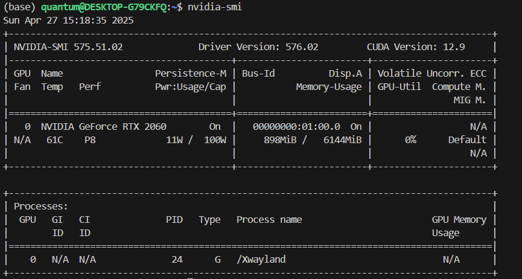
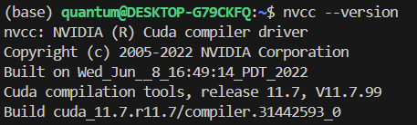
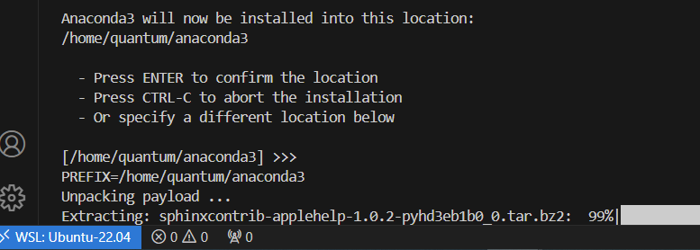

# 安装虚拟环境的一些总结

## [Windows](./Windows/readme.md)

## [WSL](./WSL/readme.md)

## [Linux](./Linux/readme.md)

Linux系统安装、CUDA环境配置

## [虚拟环境管理](./venv.md)

python venv、anaconda、miniconda、uv

## [Git](./Git/readme.md)

使用Git和GitHub

## [实例](./EnvInstallEg/readme.md) 

为一些项目安装环境

- [ManiGaussian](./EnvInstallEg/ManiGaussian.md)在Windows和WSL都无法使用，Windows无法使用Pyrep，WSL使用RLBench会报渲染错误。
- [DeerFlow](./EnvInstallEg/DeerFlow.md)字节推出的，使用uv可以轻松部署。
- [VideoAgent](./EnvInstallEg/VideoAgent.md)北京大学的项目。

## 环境检查

运行`python envtest.py`检查Python版本、GPU信息、CUDA版本、Pytorch版本、Pytorch安装情况；setuptools、pip、ninja等工具的信息。

## 语言配置

### [HelloWorld](./HelloWorld/readme.md)

## 前言

### 环境变量

环境变量是一种动态的值，它可以在计算机的操作系统中为运行中的进程提供配置信息。简单来说，环境变量是一些键值对，它们存储了操作系统或用户定义的信息，这些信息可以被操作系统本身、应用程序或者脚本使用来调整其行为。

从结果看，环境变量就是在命令行输入一个命令，操作系统知道用什么工具来执行。如果没有环境变量，你可以直接使用对应的文件执行。

以windows为例，在cmd中输入  `python helloworld.py`
和输入 `/path/to/python.exe helloworld.py`
是一样的，后者可以直接找到python解释器，用解释器执行helloworld.py。设置python的环境变量，就是让windows知道如何执行python。

## 安装结果

### WSL

安装NVIDIA

WSL安装CUDA的结果

安装Anaconda
